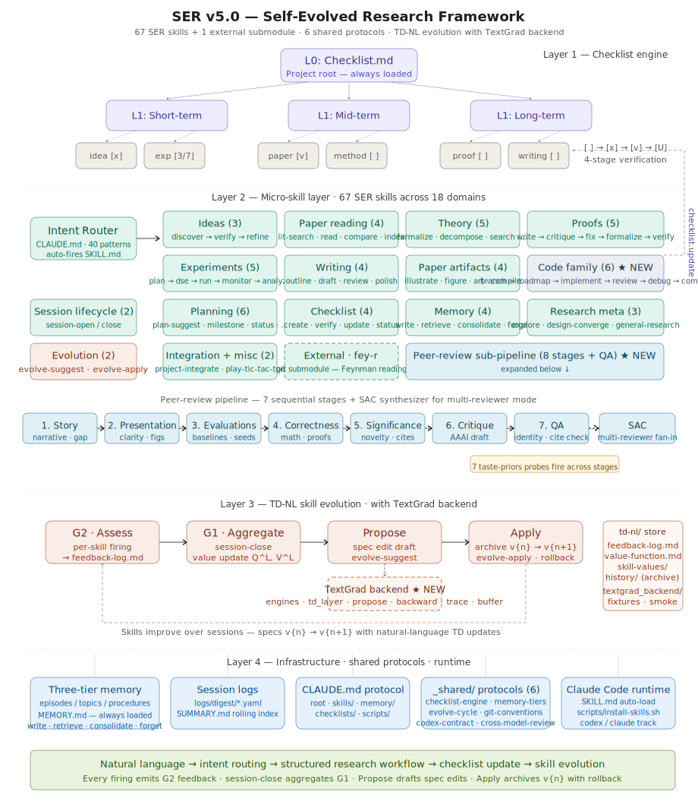

# SER — 自进化科研框架 (Self-Evolved Research)

> 面向 [Claude Code](https://docs.anthropic.com/en/docs/claude-code) 的行为驱动科研协作框架。
> 技能自动触发，框架会在使用过程中持续改进自身技能。
>
> **[English README](README.md)**

<p align="center">
  
</p>

## 功能简介

你只需用自然语言描述需求，SER 会自动识别意图并路由到对应的微技能：

| 你说 | SER 触发 |
|------|---------|
| "我在读这篇论文……" | `paper-read` — 生成结构化笔记 |
| "帮我 arxiv 搜一下 X" | `paper-lit-search` — arXiv + Semantic Scholar 检索 |
| "这个证明对不对？" | `proof-critique` — 逐步核查 |
| "证明一下……" | `proof-write` — 从零起草证明 |
| "接下来该做什么？" | `plan-suggest` — 排序任务建议 |
| "设计一下实验" | `experiment-plan` — 主张 / 变量 / 基线 |
| "扫一下这几个超参" | `experiment-dse` — 搜索策略 + 配置 |
| "跑实验" | `experiment-run` — 启动 + 监控 |
| "有没有 X 的新 idea？" | `idea-discover` → `idea-verify` → `idea-refine` |
| "写一下 introduction" | `writing-draft` — 章节初稿 |
| "把结果画成柱状图" | `paper-figure` — PGFPlots / matplotlib |
| "编译论文" | `paper-compile` — pdflatex + bibtex/biber |
| "实现一下这个功能" | `code-roadmap` → `code-implement` → `code-review` → `code-commit` |
| （结束对话） | `session-close` — 自动归档 |

每次技能执行都会产生反馈。跨多轮会话后，SER 基于自然语言 TD 学习对自身技能说明书提出改进建议——**今天你用的技能，明天会更好用**。

## 快速开始

### 1. 克隆仓库

```bash
git clone --recurse-submodules https://github.com/Shiien/Self-Evolved-Research-Framework.git
cd Self-Evolved-Research-Framework
```

> **已经 clone 过但没有带 `--recurse-submodules`？** 执行：
> ```bash
> git submodule update --init --recursive
> ```

### 2. 运行 Setup

```bash
bash scripts/setup.sh
```

该脚本生成 `config.yaml`、初始化记忆系统并建好所有目录结构。可重复执行，幂等。

### 3. 配置项目

编辑 `config.yaml`：

```yaml
project:
  name: "你的研究项目"
  status: "phase-0-exploration"
  created_at: "2026-03-19"

research:
  domain: "你的领域"
  sub_domain: "你的子方向"
  keywords: [...]
```

### 4. 开始工作

```bash
claude
```

SER 会自动：
1. 读取 config 与记忆（`session-open`）
2. 输出状态横幅
3. 直接等待你的科研请求——无需任何命令

### 5. 将技能安装到 `.claude/skills/`

```bash
bash scripts/install-skills.sh            # 复制到 ./.claude/skills
bash scripts/install-skills.sh --link     # 软链接（适合开发调试）
bash scripts/install-skills.sh --user     # 安装到 ~/.claude/skills
bash scripts/install-skills.sh --list     # 列出已识别的技能
bash scripts/install-skills.sh --dry-run  # 预演，不写入
bash scripts/install-skills.sh --force    # 覆盖已存在的技能
```

**按族选装** —— 用通配符挑选或排除：

```bash
bash scripts/install-skills.sh --only 'paper-*'
bash scripts/install-skills.sh --only 'code-*,paper-figure'
bash scripts/install-skills.sh --exclude 'theory-*,proof-*'
```

**Codex 轨道** —— 针对提供 Codex 增强版的技能
（`code-implement`、`code-review`、`writing-review`、`idea-verify`）：

```bash
bash scripts/install-skills.sh --codex-track claude   # 默认，仅 Claude 版
bash scripts/install-skills.sh --codex-track codex    # Codex 增强的跨模型评审
```

`codex` 轨道会多接一次 Codex：
`code-implement` 在中大型任务上调用 `/codex:rescue` 兜底；
`code-review` 增加 `/codex:review` 作为第二评审人；
`writing-review` 增加第 3 位 Codex 同行评审；
`idea-verify` 通过 `mcp__codex__codex` 增加第 4 个证据源。
选择 `codex` 轨道时，安装器会严格预检 Codex CLI 登录、
`/codex:review`、`mcp__codex__codex`，缺任何一项都会直接中止。

> **使用 `--codex-track codex` 之前请先准备：**
> - 在本项目里安装 **Codex 的 Claude Code 插件**（提供 `/codex:*` 斜杠命令与
>   `mcp__codex__codex` MCP 服务器）。按 Codex Claude Code 插件的官方说明在
>   你的环境里装好。
> - 用 `codex login` 登录一次（ChatGPT 或 API key）。
> - **强烈建议在 Codex（而不是 Claude Code）里装上
>   [Superpowers](https://github.com/obra/superpowers)** —— 它是 Codex 端的
>   插件，会显著提升 Codex 轨道上 TDD / 规划 / 评审的效果。安装器不会对它做
>   预检（因为它在 Codex 里），但 Codex 轨道的技能默认假设它已启用。

每个 SER 技能都住在 `skills/` 下的独立目录里，带标准 `SKILL.md`
（YAML frontmatter + 正文），安装完成后 Claude Code 会自动发现与自动触发。

## 技能总览（57 个 SER + 1 个外部）

每个技能位于 `skills/{skill-name}/SKILL.md`，带标准 YAML frontmatter。
标 † 的技能同时提供 `SKILL.claude.md` 与 `SKILL.codex.md` 两个变体——
在安装时通过 `--codex-track` 选择。

| 分类 | 技能 | 用途 |
|------|------|------|
| **会话生命周期** | `session-open`, `session-close` | 状态横幅 / 自动归档 |
| **读论文** | `paper-read`（标准 + Fey-R 深读）, `paper-compare`, `paper-index`, `paper-lit-search` | 阅读、对比、arXiv + Semantic Scholar 检索 |
| **写论文** | `writing-outline`, `writing-draft`, `writing-review`†, `writing-polish` | 提纲 → 初稿 → 同行评审 → 润色 |
| **论文构建** | `paper-compile`, `paper-figure`, `paper-illustrate`, `paper-art` | LaTeX 编译、数据图、架构图、像素艺术 |
| **理论** | `theory-formalize`, `theory-decompose`, `theory-search`, `theory-counterexample`, `theory-generalize` | 形式化与证明策略 |
| **证明** | `proof-write`, `proof-critique`, `proof-fix`, `proof-formalize`, `proof-verify` | 起草 → 评审 → 修补 → Lean/Coq → 局部验算 |
| **Idea** | `idea-discover`, `idea-verify`†, `idea-refine` | 缺口分析 → 新颖性核查 → 精炼提案 |
| **实验** | `experiment-plan`, `experiment-dse`, `experiment-run`, `experiment-monitor`, `experiment-analyze` | 设计 → 超参扫描 → 派发 → 监控 → 分析 |
| **编码** | `code-roadmap`, `code-branch`, `code-implement`†, `code-debug`, `code-review`†, `code-commit` | 计划 → 分支 → 实现 → 调试 → 评审 → 提交 |
| **规划** | `plan-suggest`, `plan-milestone`, `progress-capture`, `status-report`, `decision-analyze` | 项目管理 |
| **Checklist** | `checklist-create`, `checklist-verify`, `checklist-update`, `checklist-status` | 论文审计与主张追踪 |
| **探索** | `research-explore`, `design-converge` | 开放性研究与架构收敛 |
| **记忆** | `memory-write`, `memory-retrieve`, `memory-consolidate`, `memory-forget` | 跨会话持久记忆 |
| **元技能** | `evolve-suggest`, `evolve-apply`, `general-research` | TD-NL 技能自进化 + 兜底 |
| **集成** | `project-integrate` | 将 SER 并入已有项目 |

## 外部技能

| 技能 | 来源 | 用途 |
|------|------|------|
| [Fey-R](https://github.com/xvirobotics/fey-r) | `skills/external/fey-r/` | 交互式费曼法读论文——通过重现作者推导来深度理解论文 |

外部技能以 git submodule 形式接入，`scripts/setup.sh` 会自动初始化。
添加自定义外部技能：`git submodule add <url> skills/external/<name>/`。

## 技能自进化（TD-NL）

框架通过自然语言 TD 学习优化自身微技能说明书：

```
技能触发 → G2 评估（有没有用？）→ 跨会话累积
                                         ↓
session-close → G1 聚合 → 单技能价值更新 → 提出 SKILL.md 修订建议
                                         ↓
                    用户批准 → evolve-apply → 若质量下降可回滚
```

优化目标是 `skills/{skill-name}/SKILL.md` 本身。
`skills/td-nl/history/` 下保留版本归档以支持安全回滚。

## 目录结构

```
├── CLAUDE.md              # 行为协议（意图路由 + 数据契约）
├── config.template.yaml   # 拷贝为 config.yaml 后自定义
├── README.md / README.zh-CN.md / LICENSE
├── skills/
│   ├── {skill-name}/      # 57 个 SER 技能，每个带 SKILL.md + YAML frontmatter
│   ├── _shared/           # 被多个技能共同引用的跨切面基础设施
│   │   ├── checklist-engine.md
│   │   ├── memory-tiers.md
│   │   ├── evolve-cycle.md
│   │   ├── codex-contract.md       # Codex 轨道行为契约
│   │   ├── cross-model-review.md   # ADD-mode 跨模型评审协议
│   │   └── git-conventions.md      # 共享 git 工作流
│   ├── external/          # 外部技能（git submodule）
│   │   └── fey-r/         # 费曼法读论文
│   └── td-nl/             # 技能自进化基础设施
│       ├── feedback-log.md
│       ├── value-function.md
│       ├── skill-values/   # 单技能 Q^L 估计
│       └── history/        # SKILL.md 版本归档，支持回滚
├── scripts/               # 工具脚本（citation、notify、analyzer、install-skills）
├── memory/                # 三层持久记忆
│   ├── episodes/          # 近期观察（7 天保留）
│   ├── topics/            # 汇总知识（90 天）
│   └── procedures/        # 永久流程
├── background/            # 背景资料
├── methodology/           # 研究方法 + ideas
├── experiments/           # 实验代码 + 结果
├── outputs/               # 交付物（短 / 中 / 长期 + paper/）
├── resources/             # 参考资料（papers/ + repos/）
├── logs/digest/           # 会话日志
└── docs/                  # 计划与报告
```

## CLAUDE.md 是怎么工作的

SER 由 `CLAUDE.md` 驱动——这是一份 Claude Code 会自动读取的行为协议，定义了：

- **意图路由**：40 条模式，把你的消息映射到 SER 技能
- **会话生命周期**：自动 open/close + 记忆持久化
- **数据契约**：日志、论文笔记、记忆文件的标准格式
- **进化回路**：G2/G1 反馈周期用于技能改进

每个子目录都有自己的 `CLAUDE.md`，为该区域提供局部上下文。
根 `CLAUDE.md` 是引导器，子目录下的是命名空间指南。

## 典型工作流

### 日常科研

```
（打开 claude）
→ session-open 输出状态横幅

"我想继续读 LAPA 这篇论文"
→ paper-read 生成结构化笔记

"这个推导步骤对吗？[粘贴]"
→ proof-critique 核查

"今天就到这里"
→ session-close 归档 + evolve-suggest 更新技能价值
```

### Idea 探索

```
"agent memory 方向有哪些 open problem？"
→ idea-discover 生成候选

"第二个 idea 有新颖性吗？"
→ idea-verify 比对现有文献

"就走这个方向"
→ decision-analyze 记录决策
```

### 写论文

```
"开始写"
→ writing-outline 生成结构

"写 introduction"
→ writing-draft 给出初稿

"评审一下这个版本"
→ writing-review 模拟同行评审（若 --codex-track codex 则 3 方评审）

"编译论文"
→ paper-compile 跑 pdflatex + bibtex/biber，报告错误
```

### 实验全流程

```
"设计一个实验验证主张 C"
→ experiment-plan 写出 主张 / 变量 / 基线

"扫一下学习率和 batch size"
→ experiment-dse 生成配置并配合早停运行

"开跑"
→ experiment-run 派发（带 GPU 预检与 SSH 感知）

"分析结果"
→ experiment-analyze → paper-figure 渲染出版级图表
```

### 编码工作流

```
"为 ingest 重构开个分支"
→ code-branch 创建 feat/... 分支（可选创建 worktree）

"先写个实现计划"
→ code-roadmap 拆成多步

"实现第 2 步"
→ code-implement（--codex-track codex 时可调用 /codex:rescue 兜底）

"review 一下 diff"
→ code-review（--codex-track codex 时用 /codex:review 做第 2 评审）

"commit"
→ code-commit 按共享 git 规范提交
```

## License

MIT — 见 [LICENSE](LICENSE)
